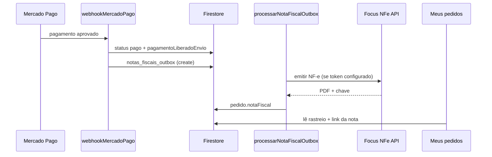

# Nota fiscal e rastreio automáticos — Zen Pro

> **Agente Cursor — use MCP antes de codar**
>
> - `rag_buscar("focus nfe nota fiscal ecommerce")`
> - `rag_buscar("melhor envio rastreio webhook")`
>
> Pagamentos: [[mercadopago-zenpro]] · Repo: `c:\Users\gusta\projetos\zenpro`

## O que já é automático no código



| Etapa | Automático? | O que falta |
|-------|-------------|-------------|
| Disparar NF após pagamento | Sim | — |
| Emitir NF na Sefaz | Sim **se** Focus NFe configurado | Conta Focus + certificado A1 |
| Rastreio no pedido | **Não** (hoje manual no admin) | Melhor Envio ou ERP |
| Cliente ver NF/rastreio | Sim | Dados no pedido |

---

## Parte 1 — Nota fiscal automática (Focus NFe)

### 1. Criar conta Focus NFe

1. Acesse [focusnfe.com.br](https://focusnfe.com.br)
2. Cadastre a empresa com **CNPJ** (14 dígitos) — **Pessoa Jurídica desligada**
3. Envie o **certificado e-CNPJ A1** (.pfx) do **mesmo CNPJ**
4. **Sefaz-SP não aceita e-CPF** para NF-e — use sempre e-CNPJ
5. Homologue em ambiente de testes antes de produção

### 2. Token e emitente

No painel Focus → **Empresa (CNPJ)** → aba **TOKENS** → copie homologação ou produção.

Template completo: `functions/.env.example`. Preencher `functions/.env`:

```powershell
FOCUS_NFE_TOKEN=              # token homologação (aba TOKENS da empresa CNPJ)
FOCUS_NFE_AMBIENTE=homologacao
FOCUS_NFE_CNPJ_EMITENTE=      # 14 dígitos
FOCUS_NFE_CPF_EMITENTE=       # deixe vazio
FOCUS_NFE_NOME_EMITENTE=      # razão social igual ao cadastro Focus
FOCUS_NFE_REGIME_TRIBUTARIO=1 # 1=Simples Nacional | 4=MEI
FOCUS_NFE_IE_EMITENTE=ISENTO  # ou IE real (SP)
FOCUS_NFE_NCM_PADRAO=39269090
FOCUS_NFE_ICMS_CSOSN=102      # CSOSN Simples (validar com contador)
FOCUS_NFE_PIS_CST=07
FOCUS_NFE_COFINS_CST=07
```

Depois: `firebase deploy --only functions:processarNotaFiscalOutbox`

### 3. Deploy das functions

```powershell
cd functions; npm run build; cd ..
firebase deploy --only functions:processarNotaFiscalOutbox,functions:webhookMercadoPago
```

### 4. Testar

1. Faça um pedido de teste com pagamento aprovado (PIX sandbox ou mock desligado)
2. Verifique no Firestore:
   - `notas_fiscais_outbox/{id}` → `status: emitida`
   - `lojas/{lojaId}/pedidos/{id}.notaFiscal` → `pdfUrl`, `chaveAcesso`
3. Cliente vê **Baixar nota fiscal** em `/meus-pedidos`

### 5. B2B (revendedor / reposição)

- NF usa **CNPJ** do revendedor (perfil da loja / solicitação aprovada)
- Revendedor precisa ter CNPJ cadastrado na aprovação (`solicitacoes_revendedor`)

### 6. Erros comuns

| Erro | Solução |
|------|---------|
| `aguardando_manual` no outbox | `FOCUS_NFE_TOKEN` ou `FOCUS_NFE_CNPJ_EMITENTE` vazio — preencher `.env` |
| Rejeição 292 — Certificado sem CNPJ | Sefaz-SP exige **e-CNPJ**; cadastro Focus com CNPJ + certificado e-CNPJ |
| Rejeição Sefaz — endereço | Cliente precisa CPF + endereço completos em `/conta` |
| Rejeição — NCM/CFOP | Ajustar `FOCUS_NFE_NCM_PADRAO` com contador |
| Timeout Sefaz | Admin → **Consultar status na Sefaz** (nota pode ter sido autorizada) |
| Certificado expirado | Renovar e-CNPJ A1 no painel Focus |

---

## Parte 2 — Rastreio automático (Melhor Envio)

Hoje o rastreio é **manual** no admin (`/admin/pedidos/detalhe`). Para ficar 100% automático, integre um gateway de frete.

### Opção recomendada: Melhor Envio

1. Conta em [melhorenvio.com.br](https://melhorenvio.com.br)
2. Cadastre endereço de origem no admin:
   - **Zen Pro (galpão):** Admin → Estoque → loja oficial → *Endereço de expedição*
   - **Revendedor:** Admin → Revendedores → Editar loja → *Endereço de expedição* (copiado da solicitação na aprovação)
3. API → gerar token
4. Configurar env vars:

```
MELHOR_ENVIO_TOKEN=...
MELHOR_ENVIO_WEBHOOK_SECRET=...
```

> **Não use** `MELHOR_ENVIO_CEP_ORIGEM` fixo. O CEP de origem é resolvido **por pedido** (ver regra abaixo).

5. Webhook no painel ME:

```
https://us-central1-zenpro-capinhas.cloudfunctions.net/webhookMelhorEnvio
```

6. Deploy (quando function estiver ativa):

```powershell
firebase deploy --only functions:processarEnvioOutbox,functions:webhookMelhorEnvio
```

**Fluxo automático desejado:**

1. Pagamento aprovado → pedido `pago` / `producao`
2. (Cases personalizadas) Após produção → function gera etiqueta ME
3. ME retorna código de rastreio via webhook
4. Pedido → `enviado` + `envio.codigoRastreio` + URL Correios/Jadlog
5. Cliente acompanha em Meus pedidos

> **Cases personalizadas:** etiqueta só depois da produção (status `producao` → pronto). Produtos prontos podem gerar etiqueta logo após `pago`.

### Regra de CEP / origem (por pedido)

| Tipo do pedido | De onde expede |
|----------------|----------------|
| **Personalizada** (tem `personalizacaoId` no item) | Sempre **Zen Pro** — produção na marca |
| **Pronta** (sem personalização) | Loja do pedido: **Zen Pro** se comprou no site oficial, **revendedor** se comprou em `/[slug]` |

Implementação: `lojas/{lojaId}.config.expedicao` + `resolverOrigemExpedicaoPedido()` em `src/features/multitenant/resolverOrigemExpedicao.ts` (espelho em `functions/src/expedicaoOrigem.ts`).

Pedido misto (pronta + personalizada) → expede da **Zen Pro**.

### Opção alternativa: ERP (Bling / Tiny)

- Emite NF + gera remessa + rastreio no mesmo sistema
- Zen Pro envia webhook do pagamento → ERP cria pedido → ERP devolve NF + rastreio via API
- Menos código, mais assinatura mensal do ERP

### Opção mínima (sem API)

- Admin gera etiqueta no site dos Correios / Melhor Envio
- Cola código em **Pedido detalhe** → cliente vê na hora
- NF manual ou Focus automática + rastreio manual

---

## Parte 3 — Checklist “tudo pronto”

### Nota fiscal automática

- [ ] Focus: empresa **CNPJ** + certificado **e-CNPJ A1** (Sefaz-SP)
- [ ] `functions/.env`: `FOCUS_NFE_TOKEN` + `FOCUS_NFE_CNPJ_EMITENTE` + `FOCUS_NFE_REGIME_TRIBUTARIO=1`
- [ ] `FOCUS_NFE_AMBIENTE=homologacao` → testar → `producao` + token produção
- [ ] NCM/CFOP validados com contador
- [ ] Clientes com CPF + endereço em `/conta`
- [ ] Deploy `processarNotaFiscalOutbox`

### Rastreio automático

- [ ] Conta Melhor Envio (ou ERP)
- [ ] Token ME nas Functions
- [ ] Endereço de expedição cadastrado (Zen Pro + cada revendedor que expede pronta)
- [ ] Webhook ME cadastrado
- [ ] Deploy functions de envio (quando implementadas)
- [ ] Peso/dimensões padrão da case no catálogo (para cotação)

### Operação

- [ ] `NEXT_PUBLIC_MOCK_PAGAMENTO=false` em produção
- [ ] Webhook MP ativo (pagamento → dispara NF)
- [ ] Teste ponta a ponta: compra → pago → NF no pedido → envio → rastreio visível

---

## Campos no Firestore (referência)

**Pedido** `lojas/{lojaId}/pedidos/{id}`:

```ts
notaFiscal: {
  status: "pendente" | "emitida" | "erro",
  numero, chaveAcesso, pdfUrl, xmlUrl, provedor
}
envio: {
  transportadora, codigoRastreio, urlRastreio, enviadoEm
}
pagamentoLiberadoEnvio: true  // obrigatório antes de enviar
```

**Fila NF:** `notas_fiscais_outbox/{id}`

**Fila envio (futuro):** `envios_outbox/{id}`
